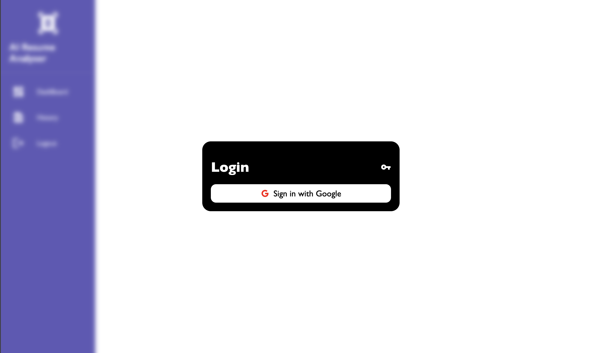
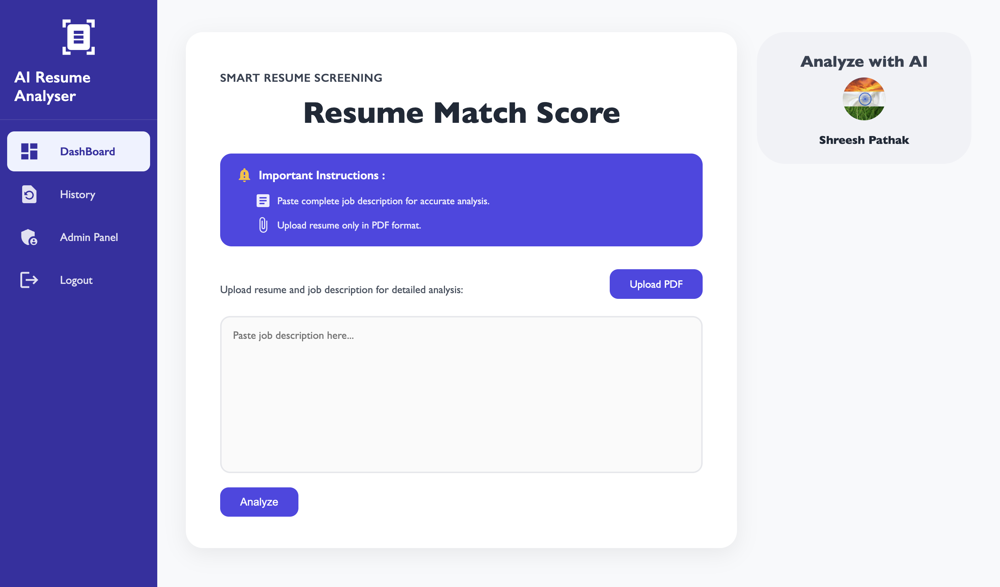
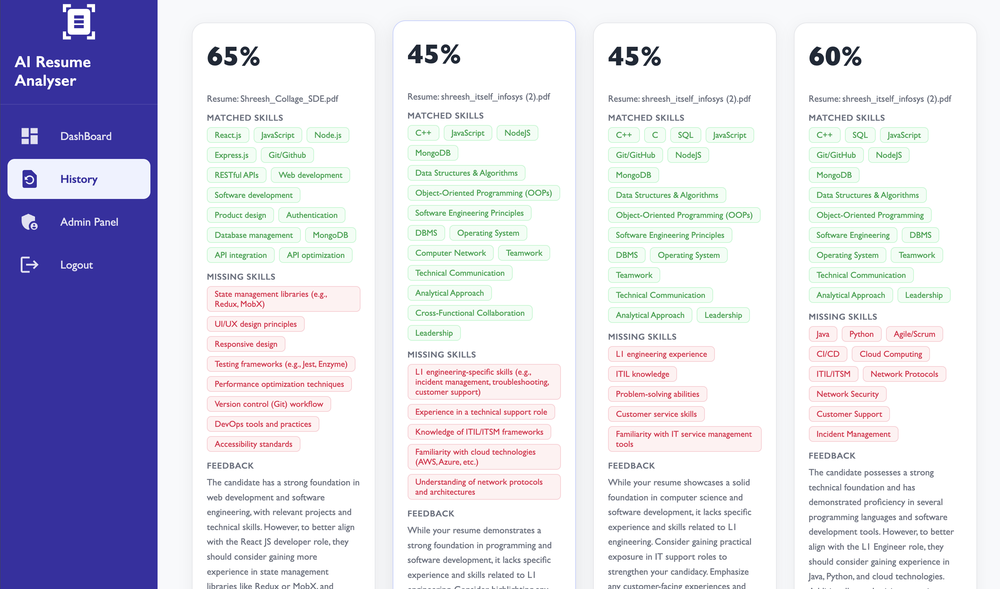
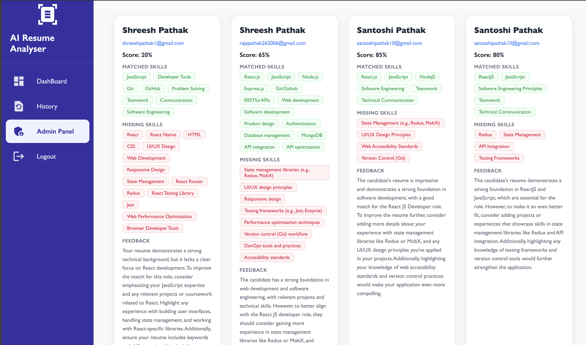

# 🤖 AI Resume Analyser

> A MERN stack web application that uses AI to intelligently analyse resumes against job descriptions — providing match scores, skill insights, and personalised improvement feedback.

---

## 🏷️ Badges


---

## 📌 Project Overview

Recruiters spend an average of 6 seconds scanning a resume. **AI Resume Analyser** helps candidates understand how well their resume matches a given job description — before it reaches a recruiter.

The application:
- Accepts a **PDF resume** and a **job description**
- Uses **Groq AI** to intelligently compare and evaluate the match
- Returns a **score out of 100**, a list of **matched and missing skills**, and **personalised feedback**
- Stores all analyses in a **history dashboard** for future reference
- Provides an **admin panel** to view all users and their resume analyses

---

## 🔗 Live Demo

> Live Demo: https://ai-resume-analyser-beta-seven.vercel.app/

---

## ✨ Features

### 🔐 Authentication
- Google Sign In via **Firebase Authentication**
- Protected routes using a custom **HOC (Higher Order Component)**
- Session persistence using **localStorage**

### 📊 Resume Analysis Dashboard
- Upload PDF resume
- Paste job description
- AI-powered match analysis using **Groq API**
- Resume match score (0–100)
- Visual display of **matched skills** (green tags)
- Visual display of **missing skills** (red tags)
- Personalised **feedback** for improvement

### 📁 History Page
- View all previous resume analyses
- See scores, matched skills, missing skills, and feedback per entry
- Responsive card-based grid layout

### 🛡️ Admin Panel
- Admin-only access
- View all users and their resume analyses
- See scores, skills, and feedback for every submission

### 📱 Responsive Design
- Fully responsive across desktop, tablet, and mobile
- Optimised layouts using CSS Modules and media queries

---

## 🛠️ Tech Stack

### Frontend
| Technology | Purpose |
|---|---|
| React.js | UI framework |
| CSS Modules | Scoped component styling |
| Axios | HTTP requests to backend |
| Material UI (MUI) | Icons and Skeleton loaders |
| React Router DOM | Client-side routing |
| Firebase | Google authentication |

### Backend
| Technology | Purpose |
|---|---|
| Node.js | Runtime environment |
| Express.js | REST API framework |
| Multer | PDF file upload handling |
| pdf-parse | PDF text extraction |
| Groq AI | Resume analysis and scoring |

### Database
| Technology | Purpose |
|---|---|
| MongoDB | NoSQL database |
| Mongoose | ODM for MongoDB |

---

## 📁 Project Structure

```
AI_RESUME_ANALYSER/
│
├── backend_ai/
│   ├── Controllers/
│   │   ├── resume.js          # Resume upload, parsing, AI analysis
│   │   └── user.js            # User registration and management
│   ├── Models/
│   │   ├── resume.js          # Resume mongoose schema
│   │   └── user.js            # User mongoose schema
│   ├── Routes/
│   │   ├── resume.js          # Resume API routes
│   │   └── user.js            # User API routes
│   ├── uploads/               # Uploaded PDF files (local storage)
│   ├── utils/
│   │   ├── multer.js          # Multer disk storage configuration
│   │   └── conn.js            # MongoDB connection
│   └── index.js               # Express server entry point
│
├── frontend_ai/
│   ├── public/
│   └── src/
│       ├── component/
│       │   ├── Admin/
│       │   │   ├── Admin.jsx
│       │   │   └── Admin.module.css
│       │   ├── Dashboard/
│       │   │   ├── Dashboard.jsx
│       │   │   └── Dashboard.module.css
│       │   ├── History/
│       │   │   ├── History.jsx
│       │   │   └── History.module.css
│       │   ├── Login/
│       │   │   ├── Login.jsx
│       │   │   └── Login.module.css
│       │   └── Sidebar/
│       │       ├── Sidebar.jsx
│       │       └── Sidebar.module.css
│       └── utils/
│           ├── HOC/
│           │   └── withAuthHOC.jsx    # Route protection HOC
│           ├── AuthContext.jsx        # Global auth state
│           ├── axios.js               # Axios instance with base URL
│           └── firebase.jsx           # Firebase config and provider
│
└── README.md
```

---

## 📸 Screenshots

### Login Page


### Dashboard


### History


### Admin Panel


---

## ⚙️ Installation & Setup

### Prerequisites
- Node.js v20+ (LTS recommended)
- MongoDB Atlas account or local MongoDB
- Firebase project with Google Auth enabled
- Cohere API key

---

### 1. Clone the Repository

```bash
git clone https://github.com/shreesh001/AI_Resume_Analyser.git
cd AI_Resume_Analyser
```

---

### 2. Backend Setup

```bash
cd backend_ai
npm install
```

Create a `.env` file in `backend_ai/`:

```env
PORT=4000
MONGODB_URI=your_mongodb_connection_string
GROQ_API_KEY=your_cohere_api_key
```

Start the backend server:

```bash
npm start
```

> Backend runs on `http://localhost:4000`

---

### 3. Frontend Setup

```bash
cd frontend_ai
npm install
```

Create a `.env` file in `frontend_ai/`:

```env
VITE_BACKEND_URL=http://localhost:4000
VITE_FIREBASE_API_KEY=your_firebase_api_key
VITE_FIREBASE_AUTH_DOMAIN=your_project.firebaseapp.com
VITE_FIREBASE_PROJECT_ID=your_project_id
VITE_FIREBASE_STORAGE_BUCKET=your_project.appspot.com
VITE_FIREBASE_MESSAGING_SENDER_ID=your_sender_id
VITE_FIREBASE_APP_ID=your_app_id
```

Start the frontend:

```bash
npm run dev
```

> Frontend runs on `http://localhost:5173`

---

## 🔌 API Endpoints

| Method | Endpoint | Description | Access |
|---|---|---|---|
| `POST` | `/api/user` | Register or login user | Public |
| `POST` | `/api/resume/addresume` | Upload resume + analyse with AI | Protected |
| `GET` | `/api/resume/history` | Get resume history for a user | Protected |
| `GET` | `/api/resume/getAdmin` | Get all users' resume data | Admin only |

---

## 🔐 Environment Variables Summary

### Backend (`backend_ai/.env`)
```
PORT                 → Express server port
MONGODB_URI          → MongoDB connection string
GROQ_API_KEY       → Cohere AI API key
```

### Frontend (`frontend_ai/.env`)
```
VITE_BACKEND_URL     → Backend API base URL
VITE_FIREBASE_*      → Firebase project config values
```

---

## 🚀 Future Improvements

- [ ] Resume PDF export with analysis report
- [ ] ATS (Applicant Tracking System) optimization score
- [ ] Resume templates and suggestions
- [ ] Analytics dashboard for admins
- [ ] Role-based access control (RBAC)
- [ ] Email notifications with feedback
- [ ] Multi-language support
- [ ] Resume version comparison

---

## 🤝 Contributing

Contributions are welcome! Please follow these steps:

1. Fork the repository
2. Create a new branch: `git checkout -b feature/your-feature-name`
3. Commit your changes: `git commit -m 'Add some feature'`
4. Push to the branch: `git push origin feature/your-feature-name`
5. Open a Pull Request

---

## 👨‍💻 Author

**Shreesh Pathak**

[](https://github.com/shreesh001)
[](https://www.linkedin.com/in/shreesh-pathak-b17b8428a/)

---

<div align="center">

⭐ If you found this project useful, consider giving it a star — it helps a lot!

</div>